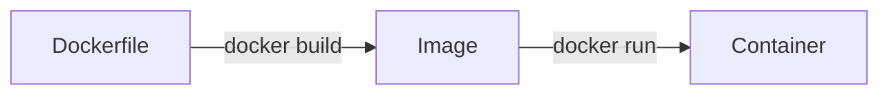

# Docker Interview Questions 🐳

## Core Concepts

### 1. What is Docker and its key advantages?
**Answer:**  
Containerization platform that packages apps with dependencies. Key benefits:
- **Portability**: Runs consistently across environments
- **Efficiency**: Shares host OS kernel (unlike VMs)
- **Isolation**: Process/filesystem separation
- **Scalability**: Lightweight container orchestration

### 2. Docker Architecture Components
**Answer:**  
- **Docker Daemon**: Background service managing containers
- **Docker Client**: CLI/GUI to interact with daemon
- **Images**: Read-only templates (built from Dockerfiles)
- **Containers**: Runnable image instances
- **Registry**: Storage for images (Docker Hub/private)

### 3. Explain Dockerfile, Image, and Container relationship
**Answer:**  

- **Dockerfile**: Recipe (instructions to build image)
- **Image**: Snapshot of app+environment
- **Container**: Running process using the image

## Common Commands
```bash
# Lifecycle
docker build -t myapp .
docker run -d -p 8080:80 --name webapp myapp
docker stop/start/rm webapp

# Inspection
docker ps -a
docker logs webapp
docker inspect webapp
```

## Scenario Question
**"How would you troubleshoot a crashing container?"**  
**Answer:**  
1. Check logs: `docker logs <container>`
2. Inspect runtime: `docker inspect <container>`
3. Enter container: `docker exec -it <container> sh`
4. Verify resources: `docker stats`
5. Review Dockerfile health checks

---

[▶ Explore Docker Compose Labs](./docker-compose-lab)  
[📚 Full Cheatsheet](./commands-cheatsheet.md)
```
